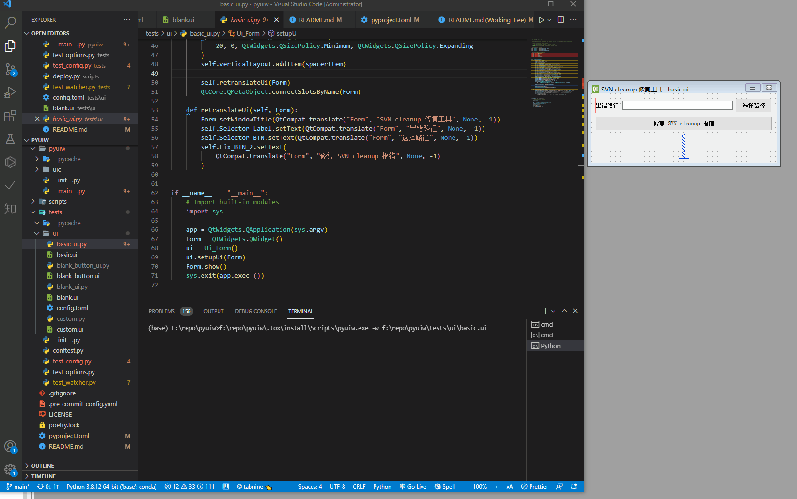

# pyuiw

Command Line Watcher for auto compile Qt ui to python file.

Original Tool Source from [pyside2-tools](https://github.com/pyside/pyside2-tools) `pyside2uic`
I modified some code for customization.

## Install pyuiw

```
pip install pyuiw
```

## How to Use


```
python -m pyuiw
pyuiw
```

two command run the same alternatively.



```
pyuiw -h
```

run this command can show up the help documentation.

```
usage: pyuiw [-h] [-p] [-o FILE] [-x] [-d] [-i N] [--from-imports] [-nq] [--QtModule module] [-nb] [-ni]
             [-w WATCH [WATCH ...]] [-e EXCLUDE [EXCLUDE ...]] [-c FILE]

Qt User Interface Compiler version , running on PySide2 5.15.2.
Command Line Watcher for auto compile Qt ui to python file.

Usage Example:

optional arguments:
  -h, --help            show this help message and exit
  -p, --preview         show a preview of the UI instead of generating code
  -o FILE, --output FILE
                        write generated code to FILE instead of stdout
                        <EXP> to define a output expression (default: <${ui_dir}/${ui_name}_ui.py>)
                        ${ui_dir} - input python directory path
                        ${ui_name} - input python file name
  -x, --execute         generate extra code to test and display the class
  -d, --debug           show debug output
  -i N, --indent N      set indent width to N spaces, tab if N is 0 (default: 4)

Code generation options:
  --from-imports        generate imports relative to '.'
  -nq, --no-useQt       ignore Qt.py module for Qt compat
  --QtModule module     customize import Qt module name (default: Qt) | only work in --no-useQt flag set
  -nb, --no-black       ignore black format code
  -ni, --no-isort       ignore isort format code

Watcher options:
  -w WATCH [WATCH ...], --watch WATCH [WATCH ...]
                        watch files or directories
  -e EXCLUDE [EXCLUDE ...], --exclude EXCLUDE [EXCLUDE ...]
                        exclude files glob expression
  -c FILE, --config FILE
                        read specific config file

```

## Configuration

`pyuiw` would read the `pyproject.toml` by default or you can set the `--config` flag to read specific config file.

here is the default options in config file.
```toml
[tool.pyuiw]
QtModule = "Qt"
exclude = [] # using glob pattern for exclude
useQt = true
watch = []
execute = true
debug = false
from_imports = false
preview = false
indent = 4
output = "<${ui_dir}/${ui_name}_ui.py>"
black = true
isort = true
```

here is a example setup.

```toml
[tool.pyuiw]
exclude = ["*launcher*"] # exclude file contain `launcher`
watch = ["./tests/ui","./test2/test.ui"] # read the file or directory get all the `.ui` file for watch
```

## TodoList

- [x] import code to the top (implement isort)
- [x] black format code
- [x] implement Qt.py for `QApplication.translate`
- [x] customize import
- [x] poetry pypi python package
- [x] poetry command line tool
- [x] add pytest
- [ ] ts file
- [ ] shield.io icon
